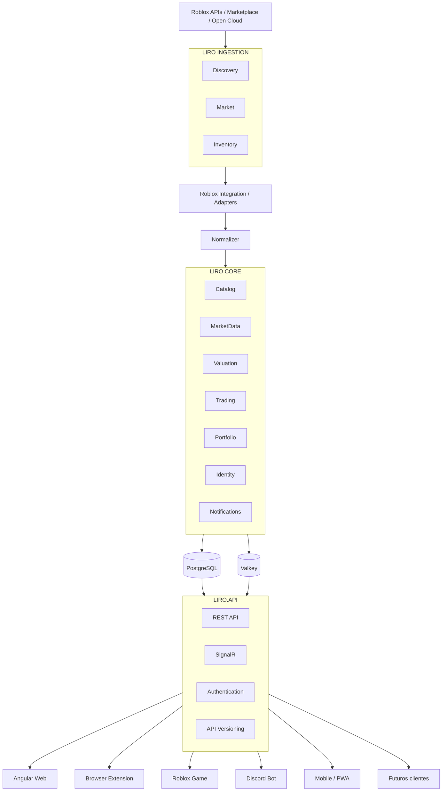
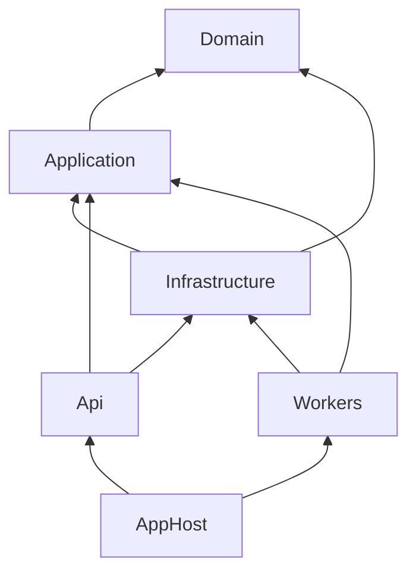
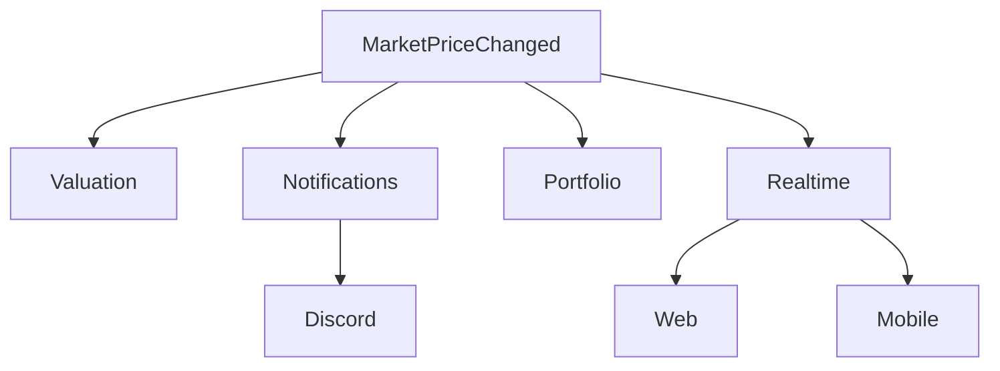
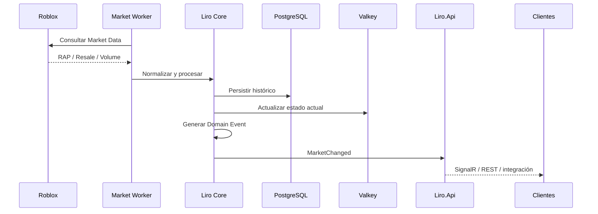
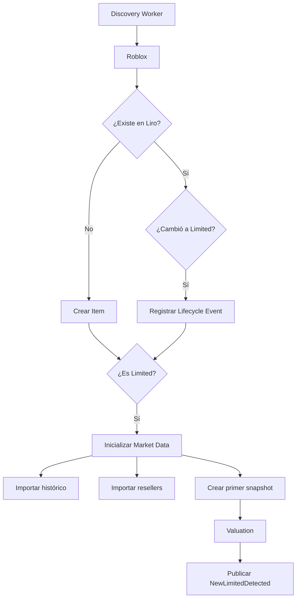
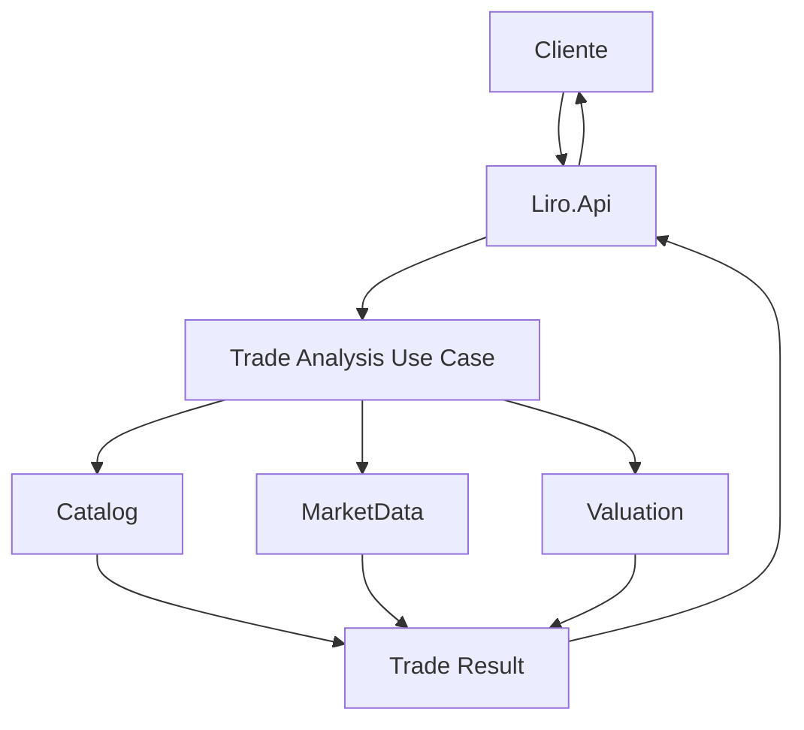
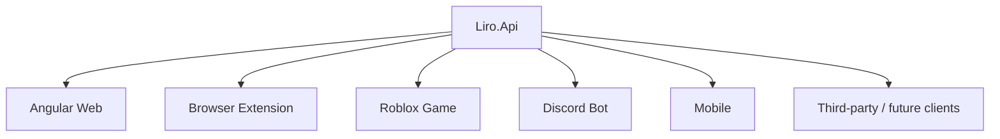

# LIRO — Arquitectura y Patrones de Diseño

## 1. Objetivo

Este documento define la arquitectura oficial de **Liro**, las responsabilidades de cada componente y los patrones de diseño que deben respetarse durante el desarrollo.

Está pensado para que cualquier desarrollador pueda entender:

- qué es Liro;
- cómo se divide el sistema;
- cómo circulan los datos;
- qué responsabilidad tiene cada proyecto;
- cómo se conectan Web, extensión, Roblox, Discord, Mobile y futuros clientes;
- qué patrones utilizamos y por qué;
- cómo podrá evolucionar la solución sin tener que reescribirla.

---

# 2. Qué es Liro

Liro es una plataforma de mercado y trading para Limiteds de Roblox.

Tendrá varios clientes:

- **Liro Web** — aplicación Angular.
- **Liro Browser Extension** — ayuda para analizar trades e items directamente desde Roblox.
- **Liro Roblox Game** — experiencia dentro de Roblox con precios e información de mercado.
- **Liro Discord Bot** — consultas y notificaciones automáticas.
- **Liro Mobile** — inicialmente web responsive/PWA y, si aporta valor, aplicación móvil posterior.
- **Futuros clientes** — otras aplicaciones, bots, integraciones o una API pública.

Todos los clientes deben consumir una única plataforma central.

> **La web, la extensión, Roblox, Discord y futuros clientes no deben implementar su propia lógica de precios, análisis, projected, demanda o valoración. Esa lógica vive en Liro Core y se expone a través de Liro.Api.**

---

# 3. Arquitectura oficial

Liro utilizará una combinación de:

1. **Modular Monolith**
2. **Clean Architecture**
3. **Event-Driven Architecture**
4. **DDD ligero**
5. **CQRS ligero**

No empezaremos con microservicios.

La aplicación será inicialmente un sistema modular bien separado y podrá extraer servicios independientes solamente cuando exista una razón real de escalabilidad, operación o despliegue.

---

# 4. Vista general



---

# 5. Idea central

Liro no debe verse como varias aplicaciones independientes:

```text
Web + Extension + Roblox + Discord + Mobile
```

Debe verse como una plataforma central:

```text
                  LIRO PLATFORM
                        │
                 única fuente de
                 datos y análisis
                        │
          ┌─────────────┼─────────────┐
          ▼             ▼             ▼
        Web         Extension       Roblox
          │
          ├────────── Discord
          ├────────── Mobile
          └────────── futuros clientes
```

---

# 6. Liro.Api como puerta de entrada

`Liro.Api` será el contrato central para consumidores externos.

Ningún cliente accederá directamente a PostgreSQL, Valkey ni a las APIs de Roblox.

```text
Cliente
   ↓
Liro.Api
   ↓
Application / Core
   ↓
Infrastructure
   ↓
PostgreSQL / Valkey / Roblox
```

Nunca:

```text
Angular → PostgreSQL
Extension → PostgreSQL
Roblox → PostgreSQL
Discord → PostgreSQL
```

---

# 7. Responsabilidades de Liro.Api

`Liro.Api` será responsable de:

- REST API;
- SignalR;
- autenticación;
- autorización;
- versionado;
- validación de entrada;
- exposición de información;
- endpoints de health;
- OpenAPI;
- entrada para todos los clientes externos.

Ejemplos futuros:

```text
GET /api/v1/items
GET /api/v1/items/{id}
GET /api/v1/items/{id}/market
GET /api/v1/items/{id}/history
GET /api/v1/items/{id}/resellers

GET /api/v1/market/trending
GET /api/v1/market/gainers
GET /api/v1/market/losers

GET /api/v1/users/{id}/inventory
GET /api/v1/users/{id}/portfolio

POST /api/v1/trades/analyze

GET /api/v1/projected
GET /api/v1/new-limiteds
```

---

# 8. REST y realtime

## REST

El cliente pregunta y Liro responde.

```text
Cliente
   ↓
GET /api/v1/items/123
   ↓
Liro.Api
   ↓
respuesta
```

Uso:

- información de items;
- histórico;
- portfolios;
- análisis de trades;
- snapshots;
- búsquedas;
- operaciones de usuario.

## SignalR

Liro avisa cuando algo cambia.

```text
MarketChanged
      ↓
Liro.Api
      ↓
SignalR
      ↓
Angular / Mobile / Extension activa
```

Uso:

- cambios de precio;
- cambios de RAP;
- rankings;
- trending;
- alertas;
- cambios de projected;
- actualizaciones de mercado.

---

# 9. Roblox como cliente especial

Roblox también consumirá `Liro.Api` mediante `HttpService`.

```text
Roblox Game
    ↓
HttpService
    ↓
Liro.Api
```

Para actualizaciones rápidas se complementará con:

```text
Liro
 ↓
Roblox Open Cloud
 ↓
MessagingService
 ↓
servidores Roblox
```

Modelo:

```text
REST Snapshot
→ obtener estado completo

Messaging
→ recibir avisos rápidos
```

El snapshot HTTP permitirá reconciliar el estado si algún mensaje se pierde.

---

# 10. Discord

Discord tendrá dos formas de integración.

## Comandos

```text
Discord Bot
    ↓
Liro.Api
    ↓
Liro Core
```

Ejemplos futuros:

```text
/item
/value
/rap
/projected
/trade
/portfolio
```

## Notificaciones automáticas

```text
Liro Event
   ↓
Notifications
   ↓
Discord Provider
   ↓
Discord
```

Ejemplos:

```text
NewLimitedDetected
ProjectedDetected
ProjectedRemoved
ValueChanged
RapChanged
LargeSaleDetected
RareSaleDetected
```

---

# 11. Proyectos del backend

La solución base contiene:

```text
Liro.Api
Liro.Workers
Liro.Domain
Liro.Application
Liro.Infrastructure
Liro.ServiceDefaults
Liro.AppHost
```

---

# 12. Responsabilidad de cada proyecto

## Liro.Domain

Es el núcleo de negocio.

Contendrá:

- entidades;
- value objects;
- reglas de negocio;
- enums;
- domain events;
- invariantes.

No debe conocer:

- PostgreSQL;
- Valkey;
- Roblox HTTP;
- Discord;
- SignalR;
- EF Core;
- Controllers.

Regla:

> `Liro.Domain` no depende de ningún otro proyecto de Liro.

## Liro.Application

Contendrá casos de uso.

Ejemplos:

```text
GetItem
GetMarketData
AnalyzeTrade
CreateTradeAd
GetPortfolio
DetectProjected
UpdateMarketSnapshot
```

También contendrá:

- commands;
- queries;
- handlers;
- interfaces/ports;
- DTOs internos;
- contratos de aplicación.

Puede depender de:

```text
Liro.Domain
```

No debe depender de:

```text
Liro.Infrastructure
```

## Liro.Infrastructure

Implementa detalles técnicos.

Contendrá:

- Entity Framework Core;
- PostgreSQL;
- Valkey;
- clientes HTTP;
- integración Roblox;
- repositorios específicos;
- implementaciones de interfaces;
- serialización externa;
- resiliencia HTTP.

Depende de:

```text
Liro.Application
Liro.Domain
```

## Liro.Api

Expone Liro al exterior.

Contendrá:

- controllers;
- endpoints;
- SignalR hubs;
- autenticación;
- autorización;
- versionado;
- OpenAPI.

Depende de:

```text
Liro.Application
Liro.Infrastructure
Liro.ServiceDefaults
```

## Liro.Workers

Ejecuta procesos de fondo.

Inicialmente contendrá:

```text
Discovery Worker
Market Worker
Inventory Worker
```

Su objetivo es mantener Liro actualizado aunque ningún usuario esté conectado.

Depende de:

```text
Liro.Application
Liro.Infrastructure
Liro.ServiceDefaults
```

## Liro.ServiceDefaults

Configuración compartida de Aspire.

Responsable de:

- OpenTelemetry;
- health checks;
- service discovery;
- resilience defaults;
- endpoints comunes de salud.

## Liro.AppHost

Orquestador local mediante .NET Aspire.

Levanta:

```text
Liro.Api
Liro.Workers
PostgreSQL
Valkey
```

En desarrollo:

```text
Visual Studio
   ↓
Liro.AppHost
   ↓
F5
```

---

# 13. Dependencias permitidas



Reglas:

```text
Domain
→ no depende de nadie.

Application
→ depende de Domain.

Infrastructure
→ depende de Application y Domain.

Api
→ depende de Application e Infrastructure.

Workers
→ depende de Application e Infrastructure.

AppHost
→ orquesta Api y Workers.
```

---

# 14. Modular Monolith

Liro será inicialmente un **Modular Monolith**.

Significa:

- un backend principal;
- una solución;
- infraestructura compartida;
- módulos claramente separados;
- límites internos definidos.

Módulos previstos:

```text
Identity
Catalog
RobloxIntegration
MarketData
Valuation
Trading
Portfolio
Notifications
```

No serán microservicios inicialmente.

---

# 15. Por qué no microservicios desde el inicio

Microservicios introducirían demasiado pronto:

- despliegues separados;
- comunicación distribuida;
- brokers;
- observabilidad más compleja;
- fallos de red;
- consistencia distribuida;
- contratos entre servicios;
- más infraestructura.

Primero usaremos:

```text
Modular Monolith
```

Y extraeremos un módulo solo cuando exista una necesidad real.

Ejemplo futuro:

```text
ANTES

Liro.Workers
 ├── Discovery
 ├── Market
 └── Inventory
```

Si Market necesita escalar de manera independiente:

```text
DESPUÉS

Liro.Discovery.Worker
Liro.Market.Worker x20
Liro.Inventory.Worker
```

---

# 16. DDD ligero

Usaremos conceptos de Domain-Driven Design sin convertir el proyecto en una implementación académica innecesariamente compleja.

Los módulos actuarán como límites de dominio.

Ejemplos:

```text
Catalog
MarketData
Valuation
Trading
Portfolio
Notifications
```

---

# 17. Bounded Contexts

## Catalog

Sabe:

- qué es un item;
- AssetId;
- CollectibleItemId;
- nombre;
- metadata;
- estado Limited;
- ciclo de vida.

No calcula:

- Liro Value;
- projected;
- trades.

## MarketData

Sabe:

- RAP;
- lowest resale;
- volume;
- sales;
- history;
- resellers;
- market snapshots.

No decide si un trade es bueno.

## Valuation

Interpreta `MarketData`.

Calcula:

- Liro Value;
- Projected Score;
- Demand Score;
- Liquidity Score;
- Trend;
- Volatility;
- Confidence.

## Trading

Usa:

```text
Catalog
MarketData
Valuation
```

para analizar trades.

---

# 18. Event-Driven Architecture

Los módulos no deben estar fuertemente acoplados.

Cuando ocurre algo relevante, se genera un evento.

Ejemplo:

```text
MarketPriceChanged
```

Otros componentes reaccionan.



Esto evita que un Worker tenga que conocer directamente todos los consumidores.

---

# 19. Domain Events

Eventos previstos:

```text
ItemDiscovered
ItemBecameLimited
NewLimitedDetected

RapChanged
LowestResaleChanged
MarketPriceChanged
MarketSnapshotCreated

ProjectedDetected
ProjectedRemoved

LiroValueChanged
DemandChanged
LiquidityChanged

TradeCreated
TradeAnalyzed

PortfolioChanged

PriceAlertTriggered
LargeSaleDetected
RareSaleDetected
```

---

# 20. Outbox Pattern

Cuando sea necesario garantizar que los eventos importantes no se pierdan, usaremos **Outbox Pattern**.

Problema:

```text
guardar cambio en DB ✅
publicar evento ❌
```

Si la aplicación falla entre ambos pasos, puede quedar inconsistente.

Outbox:

```text
Transacción
   │
   ├── guardar cambio
   └── guardar evento Outbox
```

Luego un proceso publica los eventos pendientes.

---

# 21. Ports & Adapters / Adapter Pattern

Roblox no debe filtrarse por toda la aplicación.

No queremos:

```text
MarketData
   ↓
economy.roblox.com
```

Queremos:

```text
MarketData
   ↓
IRobloxMarketProvider
   ↓
Roblox Adapter
   │
   ├── Legacy API
   └── Collectible API
```

Ventaja:

```text
Roblox cambia endpoint
        ↓
solo cambia RobloxIntegration
```

---

# 22. Normalizer Pattern

Roblox puede entregar modelos diferentes según la API.

Ejemplo:

```text
Legacy Limited
Collectible moderno
```

Liro los normaliza a un modelo interno común.

```text
Roblox Legacy
       \
        → Normalizer → Liro Market Model
       /
Collectible API
```

---

# 23. Strategy Pattern

Se utilizará para algoritmos que puedan cambiar.

```text
Valuation Engine
       │
       ├── Value Strategy
       ├── Projected Strategy
       ├── Demand Strategy
       └── Liquidity Strategy
```

Esto evita un único método gigante y difícil de evolucionar.

---

# 24. Versionado de algoritmos

Cada cálculo importante debe guardar:

```text
AlgorithmVersion
```

Ejemplo:

```text
LiroValue = 52K
AlgorithmVersion = 3
```

Permite:

- comparar algoritmos;
- recalcular históricos;
- auditar resultados;
- evolucionar sin perder contexto.

---

# 25. CQRS ligero

Separaremos conceptualmente:

```text
Commands
```

de:

```text
Queries
```

Queries:

```text
GetItem
GetMarketHistory
GetPortfolio
GetTrendingItems
GetProjectedItems
```

Commands:

```text
CreateTradeAd
AddWatchlistItem
CreateAlert
LinkRobloxAccount
```

No tendremos dos bases de datos separadas inicialmente.

---

# 26. Cache-Aside Pattern

PostgreSQL será la fuente persistente.

Valkey contendrá información caliente.

```text
GET Item Market
      ↓
¿está en Valkey?
   │
 ┌─┴─┐
Sí   No
│     │
▼     ▼
usar  PostgreSQL
      ↓
   guardar cache
```

---

# 27. PostgreSQL

Responsabilidades principales:

- items;
- usuarios;
- trades;
- portfolios;
- histórico;
- market snapshots;
- configuraciones;
- lifecycle;
- eventos persistentes.

PostgreSQL representa la información persistente.

---

# 28. Valkey

Valkey será utilizado para datos rápidos y temporales.

Ejemplos:

```text
RAP actual
Lowest Resale actual
Liro Value actual
Projected status
Trending
Top gainers
Top losers
rankings
cache
estado temporal
```

Valkey no sustituye PostgreSQL.

---

# 29. Background Worker Pattern

Liro necesita procesos que funcionen aunque no exista tráfico de usuarios.

Por eso existe:

```text
Liro.Workers
```

Inicialmente:

```text
Discovery Worker
Market Worker
Inventory Worker
```

---

# 30. Discovery Worker

Pregunta:

> ¿Qué items existen o cambiaron?

Responsable de:

- descubrir nuevos items;
- detectar nuevos Limiteds;
- detectar items normales convertidos en Limited;
- actualizar metadata;
- reconciliar catálogo.

---

# 31. Market Worker

Pregunta:

> ¿Qué está pasando con los Limiteds conocidos?

Responsable de:

- RAP;
- resale;
- resellers;
- volume;
- historical points;
- snapshots.

---

# 32. Inventory Worker

Responsable de:

- sincronizar inventarios cuando corresponda;
- actualizar portfolios;
- realizar operaciones de inventario fuera del request del usuario.

---

# 33. Retry Pattern

Las APIs externas pueden fallar.

Ejemplo:

```text
Liro
 ↓
Roblox
 ↓
429 Too Many Requests
```

El Worker podrá reintentar sin afectar al usuario.

---

# 34. Exponential Backoff

Los reintentos no deben hacerse agresivamente.

Ejemplo conceptual:

```text
1 s
2 s
4 s
8 s
```

según el tipo de fallo.

---

# 35. Circuit Breaker

Si Roblox está fallando continuamente, Liro no debe seguir golpeando el servicio indefinidamente.

```text
Roblox falla repetidamente
        ↓
Circuit Breaker OPEN
        ↓
esperar
        ↓
probar nuevamente
```

---

# 36. Rate Limiting

Los Workers deberán respetar límites externos.

```text
Queue
  ↓
Workers
  ↓
Rate Limiter
  ↓
Roblox
```

---

# 37. Idempotency

Un mismo dato puede llegar varias veces.

Ejemplo:

```text
Market Snapshot
10:00
RAP 4100
```

Si se procesa dos veces, Liro no debe crear duplicados.

Se utilizarán:

- claves únicas;
- upserts;
- identificadores de evento;
- validaciones de idempotencia.

---

# 38. Unit of Work

Entity Framework Core `DbContext` ya cumple gran parte del rol de Unit of Work.

No crearemos una abstracción adicional sin necesidad.

`LiroDbContext` controlará:

- tracking;
- transacciones;
- SaveChanges.

---

# 39. Repository Pattern

No utilizaremos un `GenericRepository<T>` para todo.

No queremos envolver EF Core sin necesidad.

Crearemos repositorios específicos solamente cuando una parte del dominio realmente se beneficie.

Ejemplo:

```text
IMarketSnapshotRepository
```

si contiene consultas complejas específicas del mercado.

---

# 40. Observer / Publish-Subscribe

SignalR y las notificaciones siguen un modelo Observer/Pub-Sub.

```text
evento
  ↓
suscriptores
```

Ejemplo:

```text
ProjectedDetected
   │
   ├── Web
   ├── Discord
   └── Mobile
```

---

# 41. Notification Provider Pattern

Notifications no debe conocer Discord directamente en la lógica central.

Conceptualmente:

```text
INotificationProvider
        │
        ├── DiscordNotificationProvider
        ├── WebNotificationProvider
        ├── MobileNotificationProvider
        └── futuros providers
```

Esto permite añadir canales sin modificar el núcleo.

---

# 42. API Versioning

Los clientes dependerán de contratos.

Por eso la API será versionada.

```text
/api/v1/items
```

En el futuro:

```text
/api/v2/items
```

sin romper necesariamente clientes existentes.

---

# 43. DTO Pattern

Las entidades internas no se expondrán directamente.

Ejemplo:

```text
Item
```

no tiene por qué ser el mismo objeto que:

```text
ItemResponse
```

Esto evita acoplar contratos públicos con el modelo interno.

---

# 44. Dependency Injection

.NET será responsable de registrar implementaciones.

Ejemplo conceptual:

```text
IRobloxMarketProvider
        ↓
RobloxMarketProvider
```

Esto facilita:

- pruebas;
- sustitución de implementaciones;
- separación de capas.

---

# 45. Realtime por cliente

## Web

```text
REST + SignalR
```

## Extension

```text
REST + SignalR cuando esté activa y tenga sentido
```

No dependerá de una conexión permanente debido a Manifest V3.

## Roblox

```text
REST Snapshot + Open Cloud / Messaging
```

## Discord

```text
REST para comandos + eventos para notificaciones
```

## Mobile

```text
REST + SignalR
```

---

# 46. Flujo completo de actualización de mercado



---

# 47. Flujo de un nuevo Limited



---

# 48. Flujo de análisis de trade



---

# 49. Arquitectura de desarrollo local

```text
Visual Studio
   ↓
Liro.AppHost
   ↓
.NET Aspire
   │
   ├── Liro.Api
   ├── Liro.Workers
   ├── PostgreSQL
   └── Valkey
```

PostgreSQL y Valkey se ejecutan mediante Docker.

---

# 50. Estado actual de infraestructura

Actualmente ya funciona:

```text
.NET 10
ASP.NET Core
Aspire
Docker

Liro.AppHost
Liro.Api
Liro.Workers
Liro.Domain
Liro.Application
Liro.Infrastructure
Liro.ServiceDefaults

PostgreSQL
Valkey

API → PostgreSQL
API → Valkey
```

---

# 51. Arquitectura objetivo de clientes



---

# 52. Seguridad arquitectónica

Los secretos no deben almacenarse en código.

No guardar:

```text
API Keys
Roblox secrets
Discord tokens
JWT secrets
passwords
cookies
```

Usaremos:

- User Secrets en desarrollo;
- variables de entorno;
- secret stores del proveedor en producción.

---

# 53. Observabilidad

Liro utilizará OpenTelemetry.

Queremos poder seguir:

```text
Roblox Request
      ↓
Worker
      ↓
Application
      ↓
PostgreSQL
      ↓
Valuation
      ↓
Valkey
      ↓
Liro.Api
      ↓
Cliente
```

Se observarán:

- traces;
- metrics;
- logs;
- health checks.

---

# 54. Principios obligatorios

## Una única fuente de verdad

No:

```text
web calcula projected
extension calcula projected
Roblox calcula projected
```

Sí:

```text
Liro Core calcula projected
        ↓
todos consumen el resultado
```

## Los clientes son consumidores

```text
Web
Extension
Roblox
Discord
Mobile
```

no contienen la lógica central.

## Las APIs externas están encapsuladas

Roblox siempre debe existir detrás de adapters.

## Persistencia y cache tienen roles distintos

```text
PostgreSQL
→ verdad persistente

Valkey
→ estado rápido / cache
```

## No sobrearquitectura

No añadiremos una tecnología solamente porque sea popular.

Por ahora no necesitamos:

```text
Kubernetes
Kafka
RabbitMQ
Elasticsearch
TimescaleDB
microservicios
```

Podrán añadirse cuando exista una necesidad demostrable.

---

# 55. Evolución futura

La arquitectura permite que:

```text
Modular Monolith
```

evolucione a:

```text
servicios independientes
```

sin reescribir toda la plataforma.

Por ejemplo:

```text
Catalog
Market
Trading
Notifications
```

pueden separarse en el futuro si necesitan escalado o despliegue independiente.

---

# 56. Resumen de patrones

| Patrón / enfoque | Uso en Liro |
|---|---|
| Modular Monolith | Arquitectura principal inicial |
| Clean Architecture | Separación Domain/Application/Infrastructure |
| DDD ligero | Límites de negocio y módulos |
| Bounded Contexts | Catalog, MarketData, Valuation, Trading, etc. |
| Event-Driven | Comunicación desacoplada entre módulos |
| Domain Events | Representar hechos importantes |
| Outbox | Garantizar publicación de eventos |
| Ports & Adapters | Aislar Roblox y sistemas externos |
| Adapter | Traducir APIs externas al modelo Liro |
| Normalizer | Unificar APIs legacy y modernas |
| Strategy | Algoritmos de valoración/proyección |
| CQRS ligero | Separar commands y queries |
| Cache-Aside | PostgreSQL + Valkey |
| Background Worker | Procesamiento continuo |
| Retry | Recuperación de errores temporales |
| Exponential Backoff | Reintentos controlados |
| Circuit Breaker | Proteger frente a fallos externos |
| Rate Limiting | Controlar consumo de APIs externas |
| Idempotency | Evitar duplicados |
| Unit of Work | EF Core DbContext |
| Repository específico | Queries de dominio complejas |
| Observer / Pub-Sub | Realtime y notificaciones |
| Notification Provider | Discord/Web/Mobile extensibles |
| DTO | Contratos externos separados |
| Dependency Injection | Sustituibilidad y pruebas |
| API Versioning | Evolución de contratos |

---

# 57. Stack tecnológico

```text
Backend
.NET 10
ASP.NET Core

Frontend
Angular

Arquitectura
Modular Monolith
Clean Architecture
Event-Driven
DDD ligero
CQRS ligero

Persistencia
PostgreSQL

Cache / estado caliente
Valkey

Realtime
SignalR

Background Processing
.NET Worker Services

Orquestación local
.NET Aspire

Contenedores
Docker

Observabilidad
OpenTelemetry

Extensión
TypeScript
Manifest V3

Roblox
Luau
HttpService
Open Cloud
MessagingService

Futuro
Discord
Mobile
Public API
```

---

# 58. Regla arquitectónica final

```text
                         ROBLOX
                            │
                            ▼
                    LIRO INGESTION
                            │
                            ▼
                       LIRO CORE
                            │
                  ┌─────────┴─────────┐
                  ▼                   ▼
             PostgreSQL             Valkey
                  │                   │
                  └─────────┬─────────┘
                            ▼
                        LIRO.API
                            │
        ┌───────────┬───────┼───────┬───────────┐
        ▼           ▼       ▼       ▼           ▼
       Web       Extension Roblox Discord     Mobile
                            │
                            ▼
                     futuros clientes
```

> **Liro Core conoce el negocio.**  
> **Liro Infrastructure conoce la tecnología.**  
> **Liro.Api expone la plataforma.**  
> **Liro.Workers mantienen la plataforma actualizada.**  
> **Los clientes consumen Liro, pero no duplican su lógica.**

---

# 59. Estado del documento

**Proyecto:** Liro  
**Documento:** Arquitectura y Patrones de Diseño  
**Arquitectura:** Modular Monolith + Clean Architecture + Event-Driven  
**Backend:** .NET 10 / ASP.NET Core  
**Estado:** Arquitectura base oficial
