# LIRO — Diagrama de flujo general del sistema

## Objetivo

Este documento describe el flujo principal de **Liro**, desde que Roblox expone o modifica información de un item hasta que ese cambio aparece en:

- la web de Liro;
- la extensión del navegador;
- el juego de Roblox.

Liro tendrá una única fuente interna de verdad.  
La web, la extensión y el juego **no calcularán precios ni análisis por separado**.

---

# 1. Flujo general de Liro

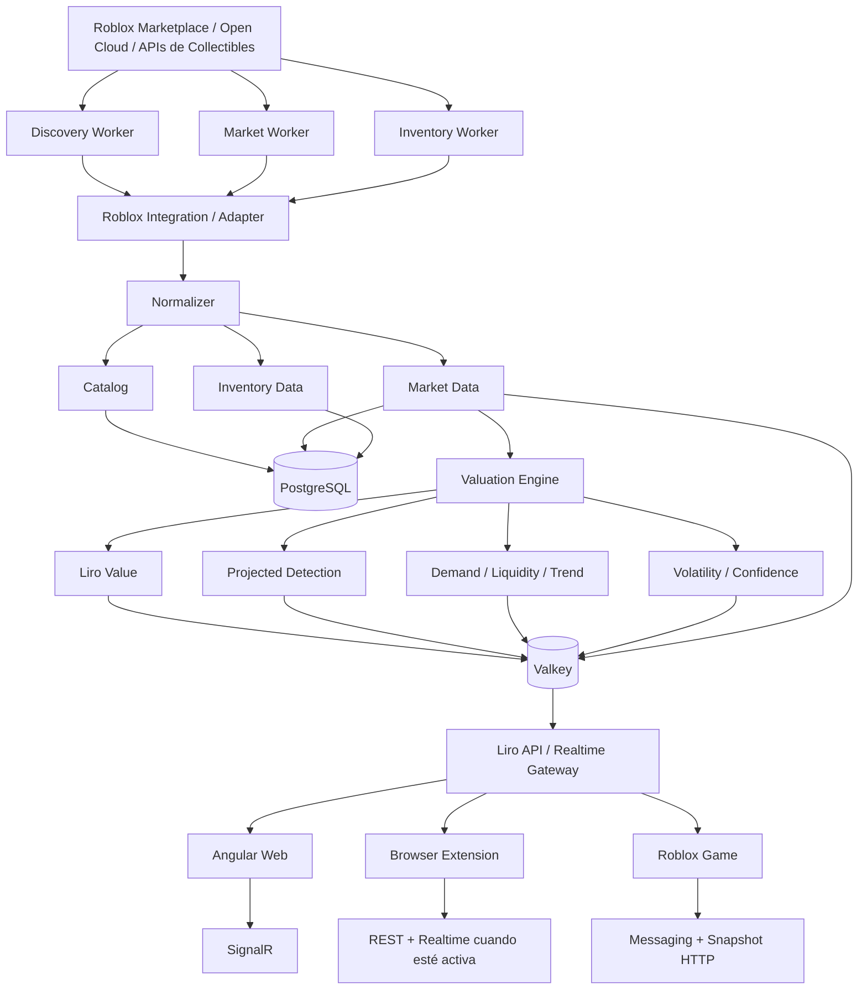

---

# 2. Principio principal

```text
Roblox
   ↓
Liro obtiene los datos
   ↓
Liro normaliza
   ↓
Liro guarda los datos originales
   ↓
Liro calcula métricas propias
   ↓
Liro publica el estado actual
   ↓
Web / Extensión / Roblox reciben la misma información
```

La regla será:

> **Roblox entrega datos. Liro transforma esos datos en información de mercado.**

Ejemplo:

```text
Roblox
────────────────────
RAP
Lowest Resale
Volumen
Resellers
Supply
Histórico

        ↓

Liro
────────────────────
Liro Value
Projected Score
Demand Score
Liquidity Score
Trend
Volatility
Trade Analysis
```

---

# 3. Flujo de descubrimiento de items

El `Discovery Worker` se encargará de descubrir:

- nuevos Limiteds;
- nuevos collectibles;
- items existentes que cambiaron;
- items normales que se convierten en Limited;
- cambios importantes de metadata.

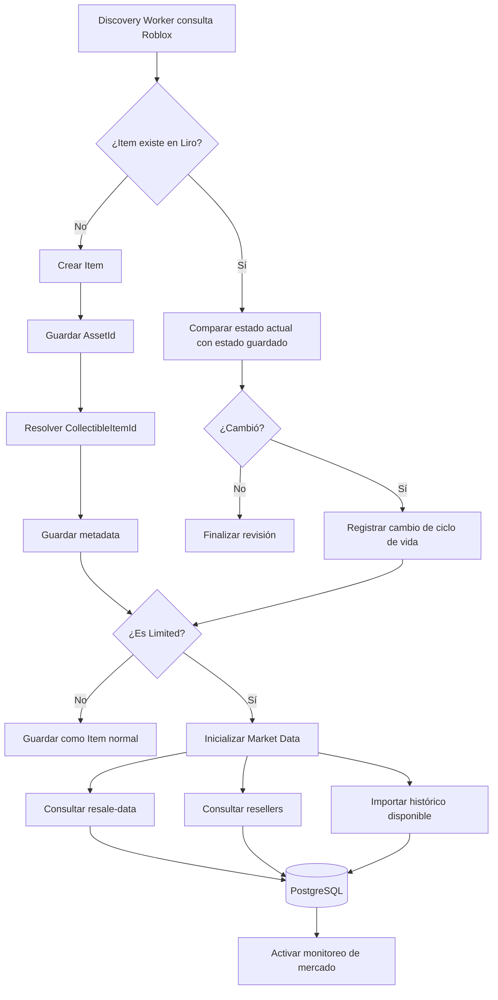

---

# 4. Item normal que se convierte en Limited

Liro no creará un item nuevo.

Mantendrá la misma identidad interna y registrará el cambio:

```text
ANTES

Liro Item Id:        8392
Roblox Asset Id:     123456
CollectibleItemId:   null
Estado:              Normal


DESPUÉS

Liro Item Id:        8392
Roblox Asset Id:     123456
CollectibleItemId:   abc-def-123
Estado:              Limited
```

El flujo será:

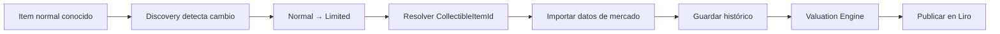

También se guardará un historial de ciclo de vida:

```text
ItemLifecycle

ItemId   Fecha         Evento
────────────────────────────────
8392     2025-04-12    Discovered
8392     2025-04-12    Normal
8392     2026-10-03    BecameLimited
```

---

# 5. Flujo de actualización de precios

El `Market Worker` se encargará de Limiteds que ya conocemos.

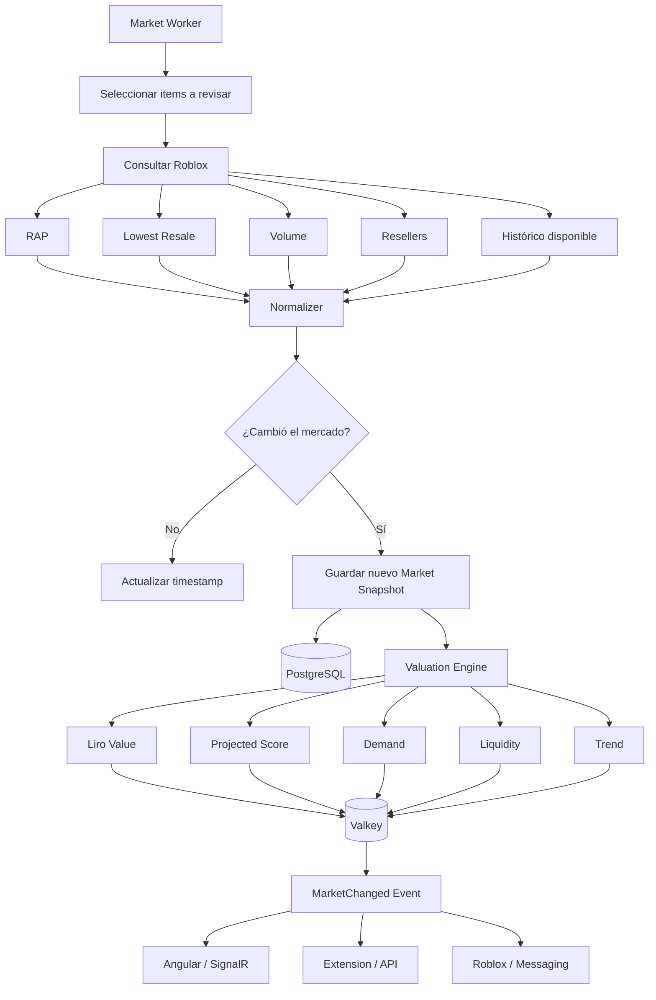

---

# 6. Frecuencia inteligente de actualización

No todos los Limiteds se consultarán con la misma frecuencia.

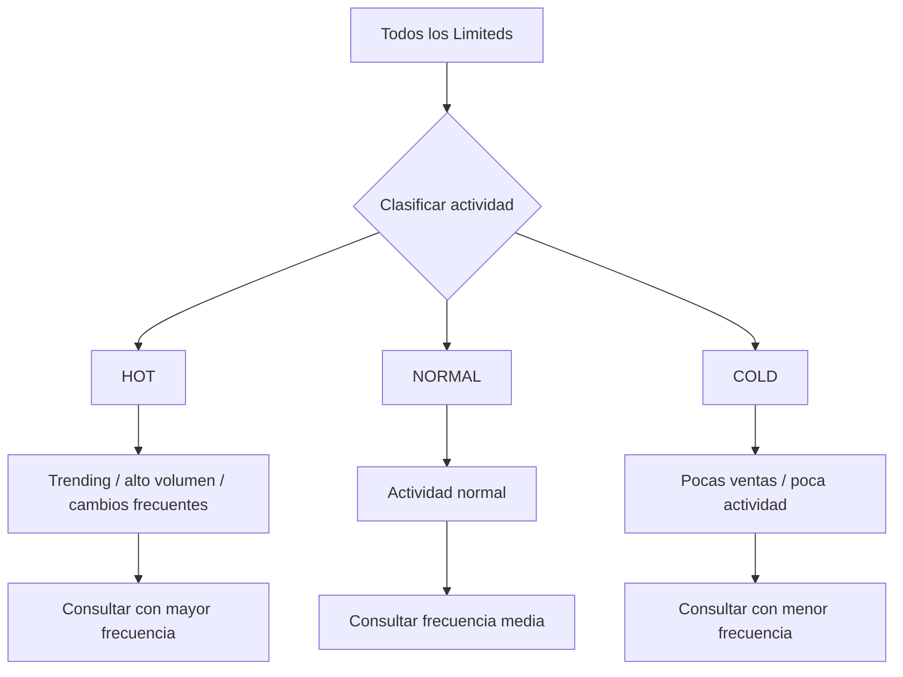

La frecuencia podrá aumentar temporalmente cuando:

```text
sube el volumen
cambian los resellers
cambia rápidamente el precio
el item se vuelve trending
muchos usuarios lo están consultando
```

Esto evita hacer:

```text
50.000 items × consulta cada 5 segundos
```

---

# 7. Flujo de almacenamiento

Liro separará los datos en tres niveles.

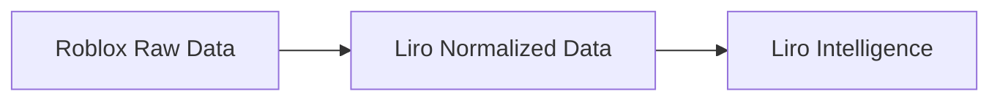

## 7.1 Datos originales / normalizados

Ejemplos:

```text
Item
AssetId
CollectibleItemId
RAP
LowestResale
Volume
Sales
Resellers
Supply
Historical Price
```

Se almacenan principalmente en:

```text
PostgreSQL
```

---

## 7.2 Histórico

Nunca sobrescribiremos el histórico.

Ejemplo:

```text
MarketHistory

Item        Fecha       RAP       Volume
────────────────────────────────────────
Item A      10:00       4,100       120
Item A      10:05       4,110       140
Item A      10:10       4,095       128
```

PostgreSQL será la fuente persistente de esta información.

---

## 7.3 Estado actual

El estado actual se mantendrá también en:

```text
Valkey
```

Ejemplo conceptual:

```text
Item A

RAP:             4,095
Lowest Resale:   4,180
Liro Value:      4,120
Projected:       false
Demand:          0.78
Liquidity:       0.64
Trend:           +2.4%
```

Valkey permitirá que la web y otros clientes obtengan el estado actual rápidamente.

---

# 8. Flujo del Valuation Engine

Roblox no calculará las métricas propias de Liro.

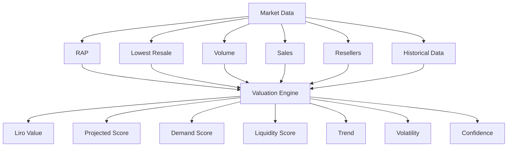

Cada cálculo deberá registrar:

```text
AlgorithmVersion
```

para poder saber con qué versión del algoritmo se obtuvo cada valor.

---

# 9. Flujo de detección de Projected

Ejemplo conceptual:

```text
Histórico normal:
52K → 53K → 54K

RAP actual:
100K

Lowest Resale:
55K

Volumen:
inusual
```

El motor analiza:

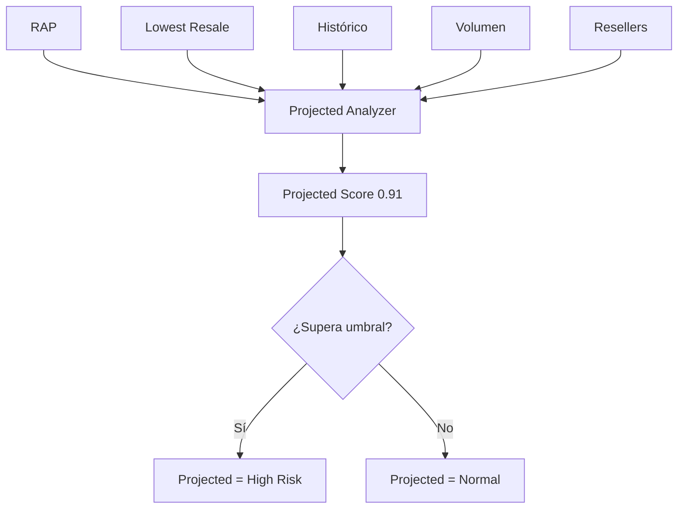

Liro preferirá almacenar una puntuación:

```text
ProjectedScore = 0.91
```

en lugar de solamente:

```text
Projected = true
```

---

# 10. Flujo de análisis de trade

La extensión y la web usarán el mismo `Trade Analysis Engine`.

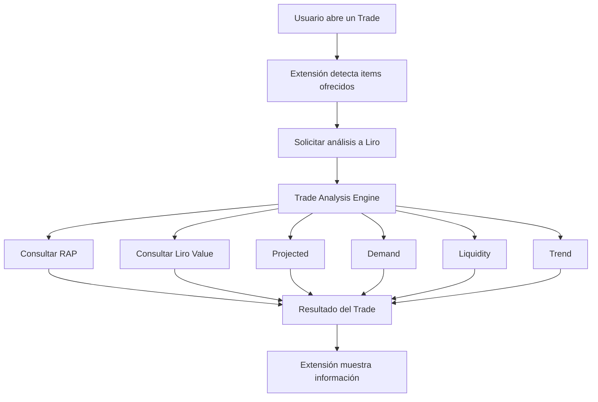

La extensión no tendrá su propio algoritmo.

Ejemplo de resultado:

```text
YOU GIVE
─────────────
Value: 450K

YOU RECEIVE
─────────────
Value: 482K

Difference: +32K

Projected Risk: Low
Demand: High
Liquidity: Medium
Trend: +3.8%
```

---

# 11. Flujo de tiempo real para la web

La web Angular utilizará SignalR.

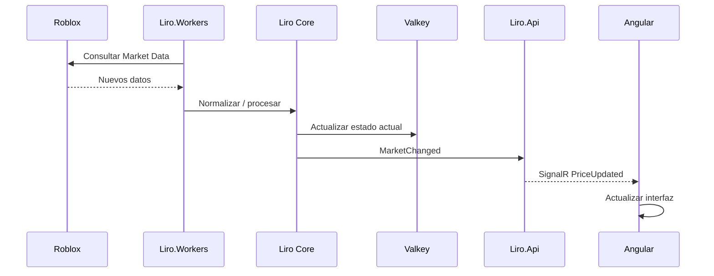

Ejemplo:

```text
4,107
  ↓
4,129
```

sin recargar la página.

---

# 12. Flujo de la extensión

Manifest V3 utiliza service workers, por lo que no dependeremos de una conexión permanente.

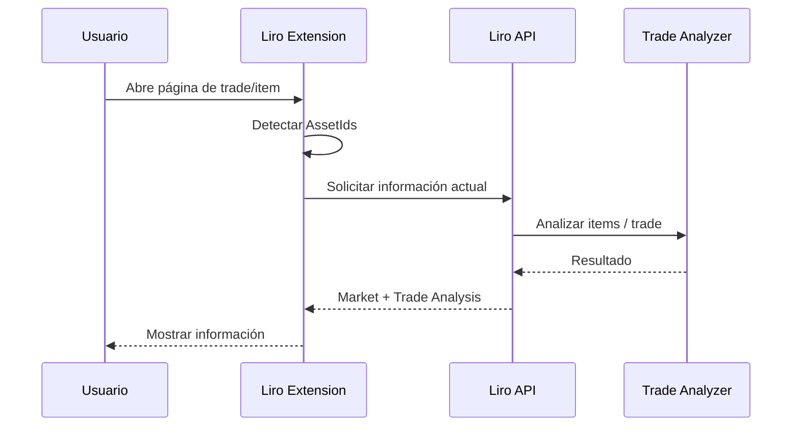

Cuando la extensión esté activa podrá recibir información realtime si aporta valor, pero siempre podrá reconstruir su estado consultando la API.

---

# 13. Flujo de tiempo real dentro de Roblox

Roblox tendrá un modelo híbrido:

```text
PUSH
+
SNAPSHOT
```

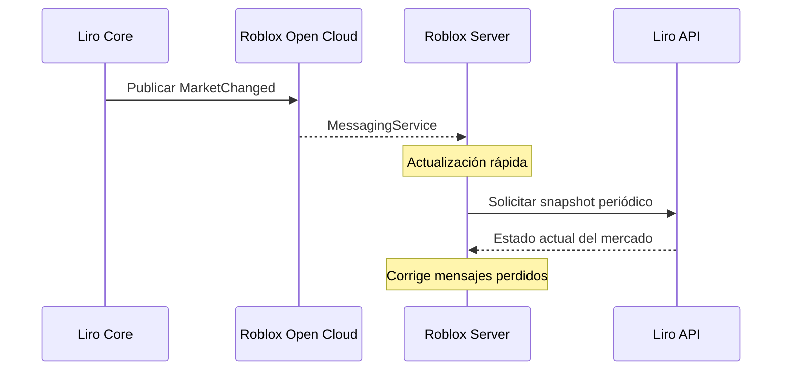

Así evitamos depender exclusivamente de `MessagingService`, cuya entrega no debe ser nuestra única fuente de sincronización.

---

# 14. Flujo de inventarios

Los inventarios no se actualizarán permanentemente para todos los usuarios.

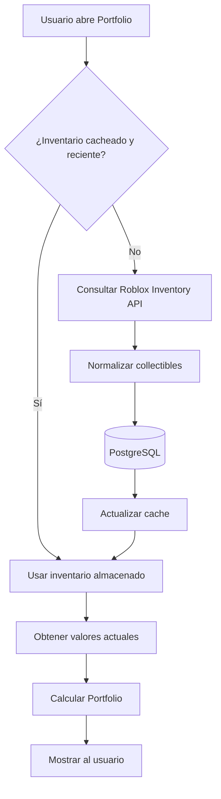

---

# 15. Flujo de datos completo

Este es el flujo central de la plataforma.

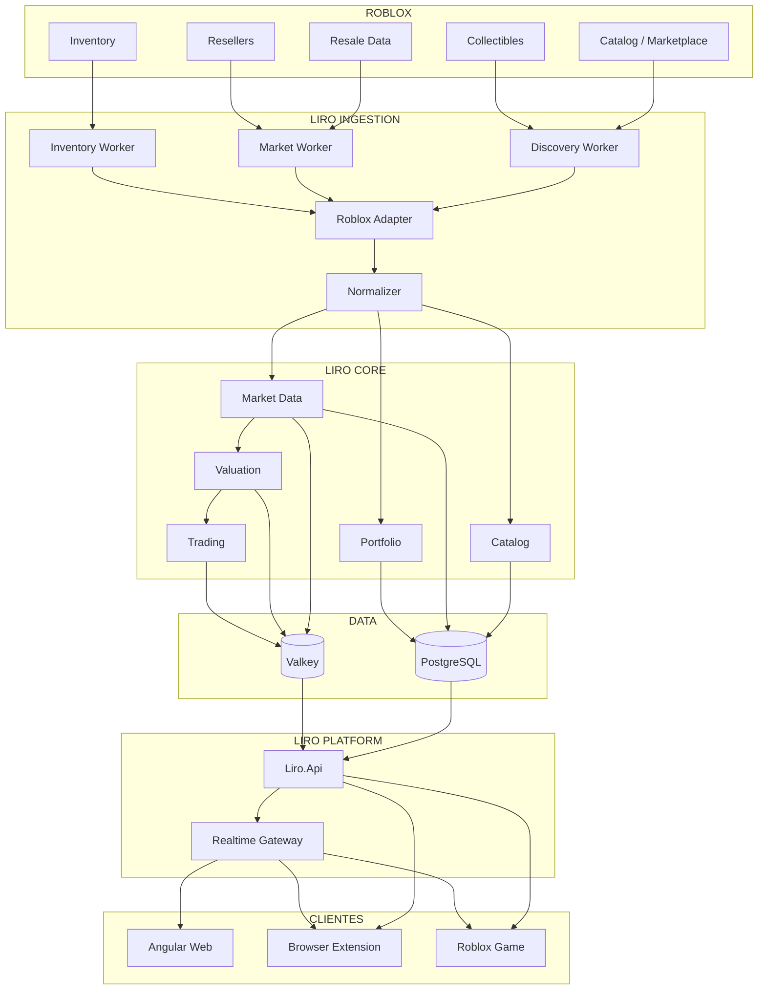

---

# 16. Flujo de desarrollo local

El entorno de desarrollo se arrancará desde Visual Studio mediante Aspire.

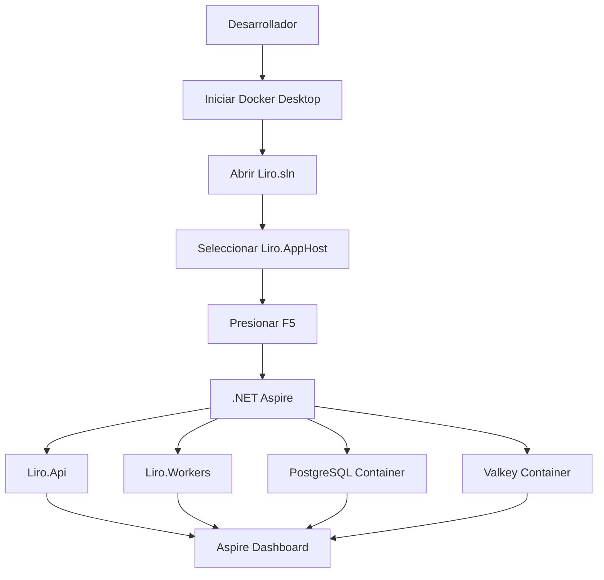

La experiencia objetivo será:

```text
Docker Desktop iniciado
        ↓
abrir Liro.sln
        ↓
F5
        ↓
Liro completo levantado
```

---

# 17. Orden recomendado de implementación

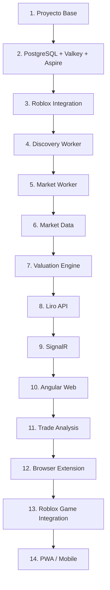

## Fase 1 — Base

```text
Liro.sln
Aspire
Docker
PostgreSQL
Valkey
estructura modular
observabilidad
```

## Fase 2 — Datos Roblox

```text
Roblox Adapter
Catalog
Discovery
Collectibles
Market Data
```

## Fase 3 — Mercado

```text
RAP
Lowest Resale
Volume
History
Resellers
Market snapshots
```

## Fase 4 — Inteligencia Liro

```text
Liro Value
Projected
Demand
Liquidity
Trend
Volatility
```

## Fase 5 — Plataforma

```text
API
SignalR
Authentication
Realtime
```

## Fase 6 — Web

```text
Market
Item pages
Charts
Profiles
Portfolio
Trade Ads
Watchlist
```

## Fase 7 — Extensión

```text
Item information
Trade analysis
Projected alerts
Gain/loss analysis
Demand/liquidity
```

## Fase 8 — Roblox

```text
Market boards
Item prices
Realtime updates
Trading tools
Portfolio
```

---

# 18. Arquitectura resumida para presentación

```text
                           ROBLOX
                              │
                              ▼
                   ┌────────────────────┐
                   │  LIRO INGESTION    │
                   │                    │
                   │ Discovery          │
                   │ Market             │
                   │ Inventory          │
                   └─────────┬──────────┘
                             │
                             ▼
                   ┌────────────────────┐
                   │     LIRO CORE      │
                   │                    │
                   │ Catalog            │
                   │ Market Data        │
                   │ Valuation          │
                   │ Trading            │
                   │ Portfolio          │
                   └─────────┬──────────┘
                             │
                   ┌─────────┴─────────┐
                   ▼                   ▼
              PostgreSQL             Valkey
                   │                   │
                   └─────────┬─────────┘
                             ▼
                   ┌────────────────────┐
                   │   LIRO PLATFORM    │
                   │                    │
                   │ API                │
                   │ SignalR            │
                   │ Auth               │
                   │ Realtime           │
                   └─────────┬──────────┘
                             │
             ┌───────────────┼───────────────┐
             ▼               ▼               ▼
        LIRO WEB        LIRO EXTENSION   LIRO ROBLOX
         Angular          TypeScript         Luau
```

---

# 19. Idea central

Liro no será:

```text
una web
+
una extensión
+
un juego
```

independientes.

Será:

```text
                   LIRO PLATFORM
                         │
                  única fuente de
                  datos y análisis
                         │
             ┌───────────┼───────────┐
             ▼           ▼           ▼
            Web       Extension    Roblox
```

Esa será la base arquitectónica del proyecto.
